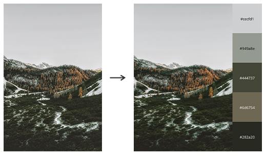
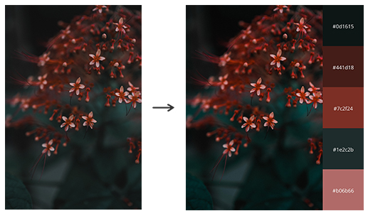
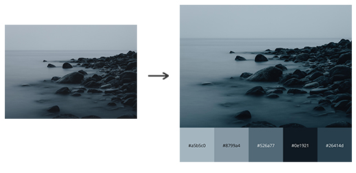

# Image-To-Palette

This script allows you to generate a color palette from an image.

## Setup

This program has the following dependencies:

- python3
- Pillow
- argparse
- matplotlib
- scikit-learn
- numpy

To install, run setup.py

` python setup.py`
