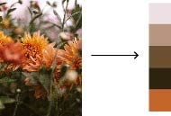
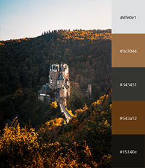

<p align="center">
  
  <h1 align="center">Image-To-Palette</h1>
</p>
<p align="center">
  </p>

This script allows you to generate a color palette from an image.




## Getting Started

To get started, use the following command:

```bash
python main.py
```

## Dependencies

This program has the following dependencies:

- python3
- Pillow
- argparse
- matplotlib
- scikit-learn
- numpy

## License

Image-To-Palette is released under the [MIT License](https://github.com/UrijHoruzij/image-to-palette/LICENSE.md).
